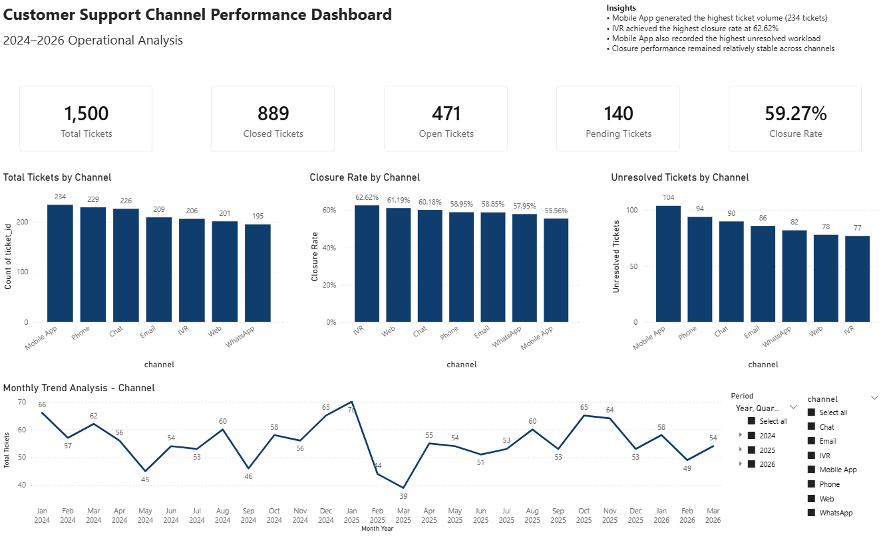
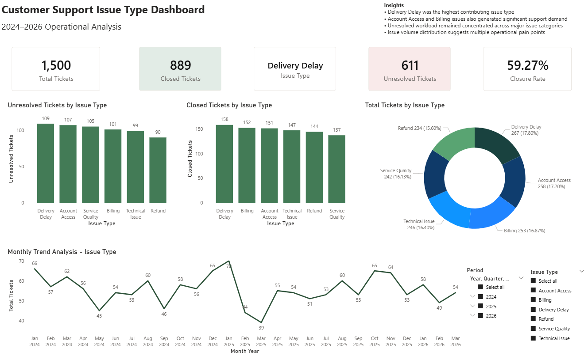
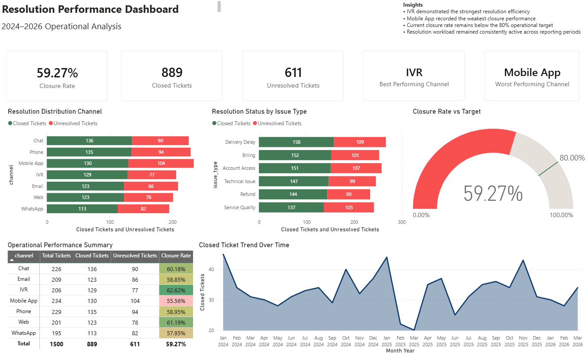

# 👋 Hi, I'm Gino

A working professional transitioning into data analytics, with hands-on experience in data cleaning, reporting, and business intelligence.

---

## 🛠️ Tools & Technologies

| Tool | Usage |
|---|---|
| SQL (MySQL) | Data cleaning, querying, aggregations, views |
| Excel | Data validation, cleaning, pivot tables, reporting |
| Power BI | Dashboards and data visualization |

## 📊 Project Overview

This project analyzes customer support ticket data to understand workload distribution, operational performance, and customer behavior across channels, segments, and time.

The goal is to simulate a real-world data analytics workflow:
SQL → Excel (validation) → Power BI (visualization)

This repository demonstrates an end-to-end analytics workflow using SQL, Excel, and Power BI for operational reporting and business intelligence analysis.

## 📌 Executive Summary

A total of 1,500 customer support tickets were analyzed from January 2024 to March 2026 to evaluate operational workload, channel performance, issue resolution efficiency, and customer support trends.

The analysis showed that Mobile App, Phone, and Chat generated the highest ticket volumes, indicating that these channels experience the greatest customer support demand. Ticket volume peaked in January 2025 with 70 tickets, while March recorded the lowest monthly volume at 39 tickets.

Overall closure performance remained relatively consistent across channels and issue types, with an overall closure rate of 59.27%. IVR achieved the highest closure rate among all support channels at 62.62%, followed by Web and Chat support.

The findings suggest that while support operations are resolving more than half of all logged concerns, opportunities remain to further improve operational efficiency, reduce recurring issues, and strengthen resolution performance across high-volume support channels.

## 📈 Business Insight

**High ticket volume does not necessarily indicate stronger operational performance.**

Out of 1,500 total tickets, 889 were successfully closed. The Mobile App channel generated the highest ticket volume (234), indicating strong customer support demand. However, it did not achieve the highest closure efficiency.

In contrast, the Phone channel demonstrated stronger closure performance relative to its ticket volume. This suggests that while the Mobile App channel handles the largest workload, it may also represent a potential operational bottleneck where resolution processes can be improved.

Additional analysis showed that ticket demand is distributed across multiple issue types and time periods, indicating that customer support workload is influenced by several operational factors rather than a single dominant issue category.

## 💡 Recommendations

- Conduct deeper analysis on high-volume support channels, particularly the Mobile App channel, to identify recurring issue drivers and operational bottlenecks.

- Strengthen ticket resolution workflows across all support channels to improve overall closure efficiency and customer response consistency.

- Monitor monthly ticket trends regularly to identify workload spikes, resource requirements, and emerging support concerns.

- Review high-frequency issue categories such as Refund, Billing, and Technical Issues to determine opportunities for process improvements or preventive solutions.

- Continue operational improvement initiatives focused on reducing recurring customer concerns while improving overall support performance and customer experience.
  
---

## 📁 Projects

### Dataset Scope
- 1,500 support tickets
- Multiple customer segments and support channels
- Includes ticket statuses, response metrics, issue types, and timestamps

### 1. Customer Support Performance Analysis (SQL)
**Folder:** `/sql`

Cleaned and standardized inconsistent ticket status data from a helpdesk system without modifying the original dataset.

**What I did:**
- Built KPI summaries for ticket volume and status distribution
- Analyzed ticket volume by channel and customer segment
- Calculated closure rates to evaluate channel performance
- Measured each channel’s contribution to total resolved tickets
- Performed multi-dimensional analysis (segment + channel + performance)

## 📊 Advanced SQL Analysis (Tasks 11–15)
- **Segment Ticket Status Breakdown**  
  Compared ticket distribution across customer segments to identify workload and resolution patterns
  
- **Open Ticket Aging Analysis**  
  Measured how long tickets remain unresolved using DATEDIFF and aging buckets
  
- **Response Time Distribution**  
  Evaluated support responsiveness by categorizing tickets into response speed groups
  
- **Issue Type Analysis**  
  Identified key drivers of support demand and calculated each issue type’s contribution to total tickets
  
- **Time-Based Trend Analysis (Monthly & Quarterly)**  
  Analyzed ticket volume trends over time using DATE_FORMAT, YEAR, and QUARTER

**Skills used:**
- Data Cleaning & Transformation (CASE WHEN, Views)
- Data Aggregation (GROUP BY, COUNT)
- Conditional Aggregation (Pivot-style reporting)
- Joins (INNER JOIN)
- Time-Based Analysis (DATE_FORMAT, YEAR, QUARTER)
- Performance Metrics (closure rates, percentages)
- Handling Missing Data (COALESCE, NULL logic)
- Multi-dimensional Analysis (segment, channel, time)

## 🗂️ SQL Analysis Coverage

This project includes structured SQL queries covering:

- Data cleaning and transformation
- KPI summary (total, open, closed, pending tickets)
- Ticket distribution by status and channel
- Channel performance analysis (closure rates)
- Closed ticket contribution by channel
- Customer segment analysis
- Multi-dimensional analysis (segment + channel performance)
- Response time and aging analysis
- Issue type contribution
- Time-based trend analysis (monthly and quarterly)

## 🧹 Data Validation & Preparation

Before building reports and dashboards, the dataset was validated and cleaned using Excel to ensure consistency and reliability.

### Validation Steps Performed
- Imported and structured the dataset into Excel Tables
- Identified missing values using `COUNTBLANK()`
- Investigated blank `order_id`, `closed_at`, and `resolution_minutes` fields
- Verified `ticket_id` uniqueness using Conditional Formatting
- Used `CLEAN()` and `TRIM()` to validate text consistency
- Assessed whether missing values were operationally valid or potential data quality issues

### Key Findings
- Blank `closed_at` and `resolution_minutes` values aligned with unresolved tickets
- No duplicate `ticket_id` values were identified
- Missing `order_id` values appeared across all statuses and issue types, suggesting order references may not be mandatory for all support interactions
  
### 2. Customer Support Dashboard (Power BI)

**Folder:** `/powerbi`

Built a multi-page interactive Power BI dashboard focused on customer support operations, issue management, and resolution performance analysis.

### Dashboard Pages

#### 1. Channel Performance Dashboard
Focused on ticket volume, closure performance, unresolved workload, and operational trends across support channels.

#### 2. Issue Type Dashboard
Analyzed issue-type contribution, unresolved workload, resolution performance, and support demand distribution.

#### 3. Resolution Performance Dashboard
Evaluated operational efficiency using closure rate monitoring, resolution benchmarking, unresolved workload analysis, and performance summaries.

### Power BI Features Used
- KPI Cards
- Gauge Charts
- Stacked Bar Charts
- Donut Charts
- Area Charts
- Matrix Visuals
- Conditional Formatting
- Interactive Cross-Filtering
- Multi-Page Dashboard Design

### Skills Used
- Power BI
- Data Visualization
- Dashboard Design
- KPI Reporting
- Operational Analytics
- Business Intelligence Reporting
- Interactive Reporting
- Data Storytelling
  
**Dashboard Features:**  
- KPI summary cards
- Ticket volume by channel
- Channel closure rate analysis
- Issue type performance breakdown
- Monthly ticket trend analysis
- Operational performance overview

**What I did:**  
- Designed KPI-focused dashboard layouts
- Created interactive visual reports
- Built trend and performance visualizations
- Applied business-focused dashboard storytelling
- Organized visuals for executive readability

## 📷 Power BI Dashboard Preview

### Channel Performance Dashboard

### Issue Type Dashboard

### Resolution Performance Dashboard

## ▶️ How to Explore

- Browse `/sql` for step-by-step queries
- `/excel` contains validation and exploratory analysis work
- Each file includes description, logic, and business use

---

## 📬 Contact

- 📧 Email: ginocaliwagan@gmail.com
- 💼 LinkedIn: https://www.linkedin.com/in/gino-caliwagan-clssyb-1a277959

---

*Finally, i was able to add my Microsoft Excel and PowerBI work then my business insights. 
